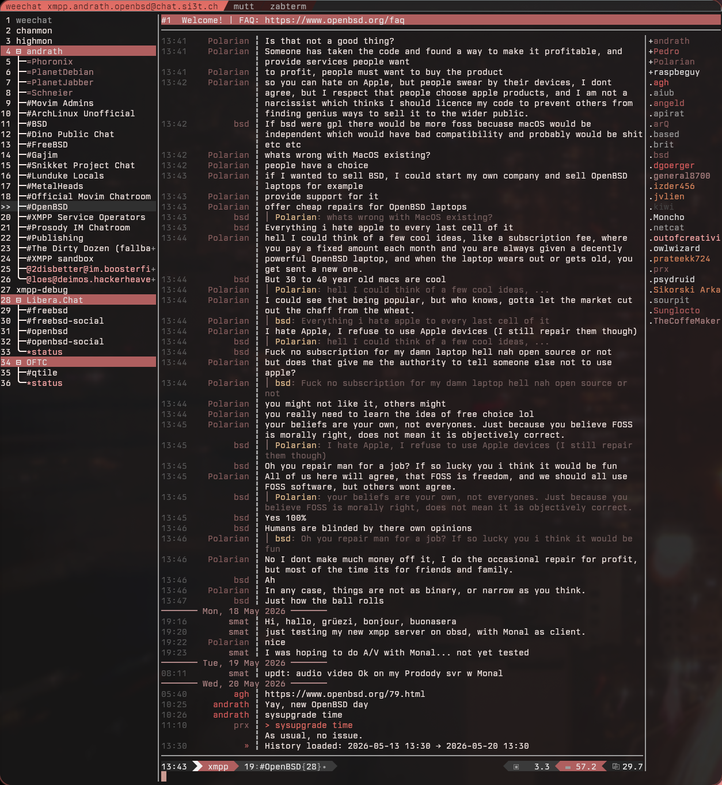

# weechat config

Weechat config with:
- Custom buflist layout (two-column: name + hotlist) based on [pascalpoitras/8406501](https://gist.github.com/pascalpoitras/8406501)
- XMPP via [xepher](https://github.com/ekollof/xepher)
- Slack via [wee-slack](https://github.com/wee-slack/wee-slack)
- Wallust/pywal integration — colors update automatically on wallpaper change



## Install

```sh
./install.sh
```

Then follow the post-install steps printed at the end.

To refresh the export after making config changes on the source machine:

```sh
./export.sh
```

---

## Plugins and scripts

### group_tools (required — do this first)

The buflist layout, powerline status bar, chanmon, and highmon all depend on
`group_tools`. It is not a compiled plugin — it is implemented entirely as
weechat triggers and items from pascalpoitras's config gist.

**Setup:** paste the commands from the gist into weechat. You only need the
sections relevant to this config: `utils_group_tools`, `buflist`, `Bars`
(titlesep/titlenosep/powerline), `chanmon`, and `highmon`. The full gist is at:

> https://gist.github.com/pascalpoitras/8406501

The exported `plugins.conf` and `trigger.conf` already contain the resulting
`plugins.var.group_tools.*` options and trigger definitions — so if you restore
from this export onto a fresh weechat, the options will be present. However,
weechat must have processed the trigger definitions at least once (i.e. the
triggers in `trigger.conf` must load on startup) for the `group_tools` command
and all derived bar items to be active.

**Verify it's working:**

```
/group_tools set buflist section left size 15
```

If that command exists, group_tools is active.

---

### xmpp.so

Compiled C++ plugin for XMPP/Jabber. The `weechat-plugins/xmpp.so` included
here was built for x86_64 Linux. If you are on a different architecture,
rebuild it:

```sh
git clone --depth 1 git@github.com:ekollof/xepher.git
cd xepher
sudo make install-deps   # installs system packages
make
make install             # installs to ~/.local/share/weechat/plugins/
```

**Configure** (in weechat, after plugin loads):

```
/xmpp connect -jid you@your.server -password yourpassword
```

Or use secured data:

```
/secure set xmpp_yourname yourpassword
/set xmpp.account.yourname.jid "you@your.server"
/set xmpp.account.yourname.password "${sec.data.xmpp_yourname}"
/set xmpp.account.yourname.autoconnect on
```

---

### wee-slack

Python script for Slack. Included in `weechat-python/wee_slack.py`.
The Slack API token is **not** included — you must re-authenticate.

**Get a token** (in weechat after the script loads):

```
/slack register
```

Follow the URL it prints, authorize the app, paste the token back.

Alternatively, if you already have a token:

```
/set plugins.var.python.slack.slack_api_token "xoxp-..."
```

---

### autosort

Keeps buffers sorted automatically. Included in `weechat-python/autosort.py`,
symlinked in `autoload/`.

No extra configuration needed — loads and works automatically.
Source: https://github.com/de-vri-es/weechat-autosort

---

### go.py

Quick buffer switching. Included in `weechat-python/go.py`, symlinked in
`autoload/`. Use `Alt+g` to open the prompt and fuzzy-match any buffer by name.

---

### cmd_help.py

Improved `/help` display. Included in `weechat-python/cmd_help.py`.
Not in autoload — loads manually with `/script load cmd_help.py`.

---

### urlgrab.py

Collects URLs from chat. Included in `weechat-python/urlgrab.py`,
symlinked in `autoload/`.

---

### weechat_debug_socket.py

A two-way debug interface for inspecting and controlling a running weechat
instance from the terminal. Useful for scripting and config work without
restarting weechat.

The script opens a Unix socket at `$XDG_RUNTIME_DIR/weechat/weechat_debug.sock`.
Each connection sends one request, receives one line back, then closes.

**Load it** (in autoload — loads automatically on startup):

```
/script load weechat_debug_socket.py
```

**Three request modes:**

| Prefix | Behavior |
|--------|----------|
| `${...}` | Evaluated with `weechat.string_eval_expression()`, result returned |
| `/` | Executed as a weechat command, returns `ok` |
| `!py ` | Evaluated as a Python expression inside weechat's Python interpreter, result returned |

**Use it** with the included `weechat-cmd` wrapper (installed to `~/.local/bin`):

```sh
# Inspect option values
weechat-cmd '${info:version}'
weechat-cmd '${buflist.format.name}'

# Execute commands
weechat-cmd '/save'
weechat-cmd '/python reload wallust'

# Python expressions — weechat API available as `weechat`
weechat-cmd '!py weechat.info_get("version", "")'
weechat-cmd '!py weechat.config_string(weechat.config_get("buflist.format.name"))'
```

Or directly with `socat`:

```sh
echo '${info:version}' | socat -T 3 - UNIX-CONNECT:/run/user/1000/weechat/weechat_debug.sock
```

**`!py` mode:**

- Expressions return their value: `!py 1 + 1` → `2`
- `print()` output is captured and returned over the socket
- Statements work — tries `eval()` first, falls back to `exec()` on `SyntaxError`
- Semicolons work for simple multi-statement one-liners: `!py x = 42; print(x)`
- For multi-line code, write to a temp file and exec it:

```sh
cat > /tmp/myscript.py << 'EOF'
import weechat
opt = weechat.config_get("buflist.format.name")
print(weechat.config_string(opt))
EOF
weechat-cmd '!py exec(open("/tmp/myscript.py").read())'
```

- **Never use bash `printf` with `\u` Unicode escapes** when passing to socat —
  the chars get mangled before reaching the socket. Construct Unicode strings
  inside the Python code instead.
- The `weechat` module is pre-imported and available in the namespace.

---

## Wallust integration

Colors update automatically when wallust runs (e.g. after a wallpaper change).

**Requirements:**
- `wallust` installed and configured
- `~/.cache/wal/colors.json` exists (run `wallust run <wallpaper>` at least once)

**How it works:**

`wallust.py` (in `python/autoload/`) reads `~/.cache/wal/colors.json` on load
and polls it every 3 seconds for mtime changes. When the palette changes it
applies colors to chat, bars, powerline segments, buflist hotlist, and
buflist buffer-type colors — all via the weechat config API (no `/set` noise).
It also recalculates xterm-256 indices for palette colors so buflist name colors
stay accurate across theme changes.

**Apply colors manually** (from inside weechat):

```
/wallust
```

---

## Secrets

Nothing in this export contains passwords or tokens. After install, set these
in weechat:

```
/secure set xmpp_yourname    <xmpp password>
/secure set znc_libera      <znc password>
/slack register             (follow prompts for Slack token)
```

The `sec.conf` file is encrypted with a machine-specific passphrase and is
intentionally excluded from this export.

---

## IRC servers

The exported `irc.conf` is not included — it contains server addresses specific
to a ZNC bouncer setup. Configure your servers manually:

```
/server add libera irc.libera.chat/6697 -tls -autoconnect
/set irc.server.libera.sasl_mechanism plain
/set irc.server.libera.sasl_username "yournick"
/set irc.server.libera.sasl_password "${sec.data.znc_libera}"
```
